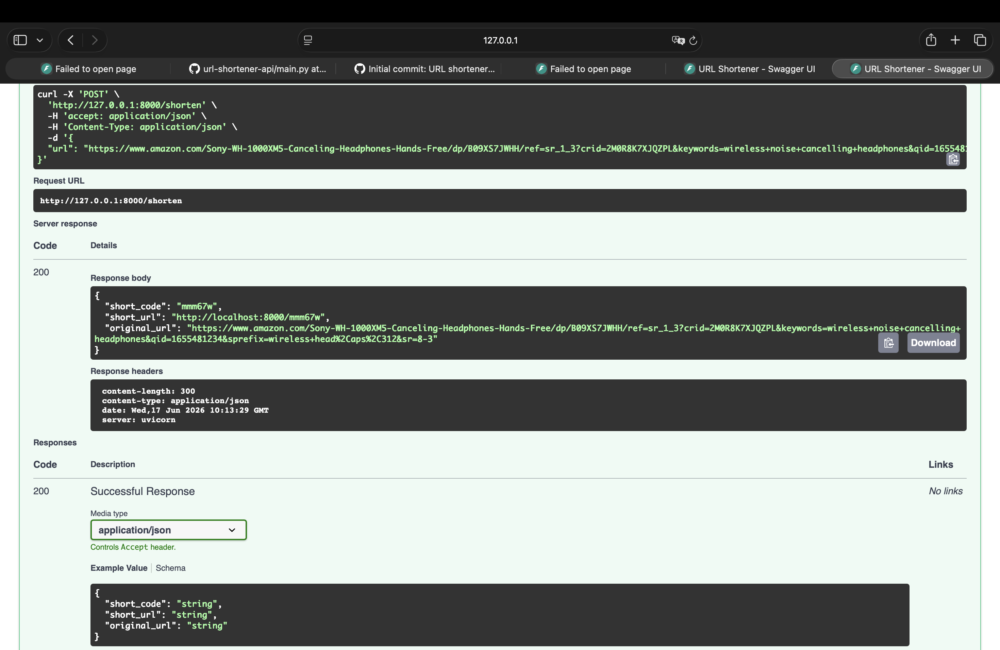

# URL Shortener API

A lightweight REST API that shortens long URLs and redirects users to the original link — built with FastAPI and SQLite.

## Tech Stack
- FastAPI
- SQLite

## Features
- Shorten a long URL into a unique short code
- Redirect from the short code to the original URL

## Running it locally

```bash
git clone https://github.com/SassySasquatsch/url-shortener-api.git
cd url-shortener-api
python -m venv venv
source venv/bin/activate
pip install -r requirements.txt
uvicorn main:app --reload
```

App runs at `http://127.0.0.1:8000`. Interactive docs at `http://127.0.0.1:8000/docs`.

## API Endpoints

| Method | Endpoint | Description |
|--------|----------|-------------|
| POST | `/shorten` | Takes a long URL, returns a short code |
| GET | `/{short_code}` | Redirects to the original URL |
| GET | `/stats/{short_code}` | Returns click count and metadata for a short code |

